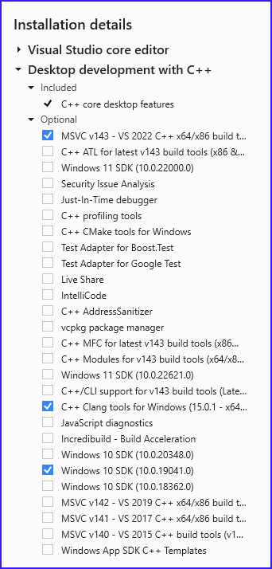

Release Notes
=============

.. Templates
   ===
   New Features
   ~~~~~~~~~~~~
   Modified Features
   ~~~~~~~~~~~~~~~~~
   Deleted Features
   ~~~~~~~~~~~~~~~~
   Applied Software
   ~~~~~~~~~~~~~~~~
   Windows-specific Software
   .........................
   Open Issues
   ~~~~~~~~~~~
   Detailed Open Issues
   ~~~~~~~~~~~~~~~~~~~~

Version 1.0.0
-------------

Release Date: dd.mm.2024

New Features
~~~~~~~~~~~~

-  TODO

Modified Features
~~~~~~~~~~~~~~~~~

-  TODO

Deleted Features
~~~~~~~~~~~~~~~~

-  TODO

Applied Software
~~~~~~~~~~~~~~~~

.. list-table::
   :header-rows: 1
   :widths: 30 10 20 10

   * - Software
     - Version
     - Remark
     - Status
   * - DBeaver - optional
     - 24.0.4
     -
     -
   * - Docker Desktop
     - 4.30.0
     -
     -
   * - Go
     - go1.22.3
     -
     -
   * - Miniconda
     - 24.3.0
     -
     -
   * - Python
     - 3.11.9
     -
     -

Windows-specific Software
.........................

**Important**: All software components should be installed in the 64 bit version!

.. list-table::
   :header-rows: 1
   :widths: 30 10 20 10

   * - Software
     - Version
     - Remark
     - Status
   * - Make for Windows
     - 3.81
     -
     -
   * - Visual Studio Community 2022
     - 2022
     -
     -

Minimal Requirements Visual Studio Community 2022
^^^^^^^^^^^^^^^^^^^^^^^^^^^^^^^^^^^^^^^^^^^^^^^^^

